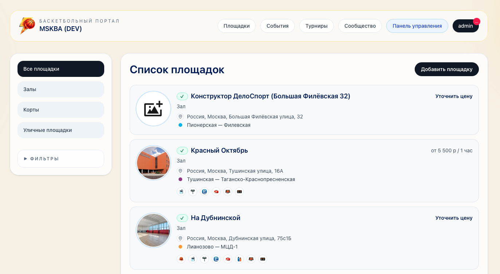
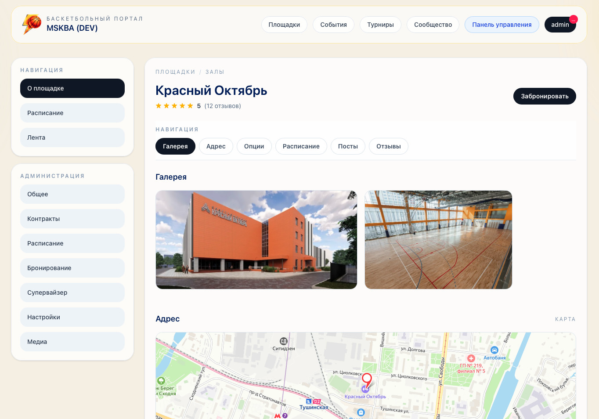
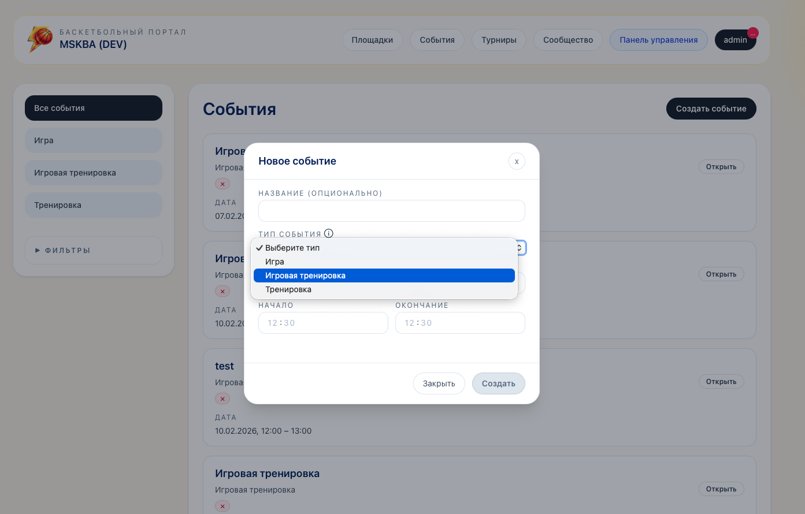
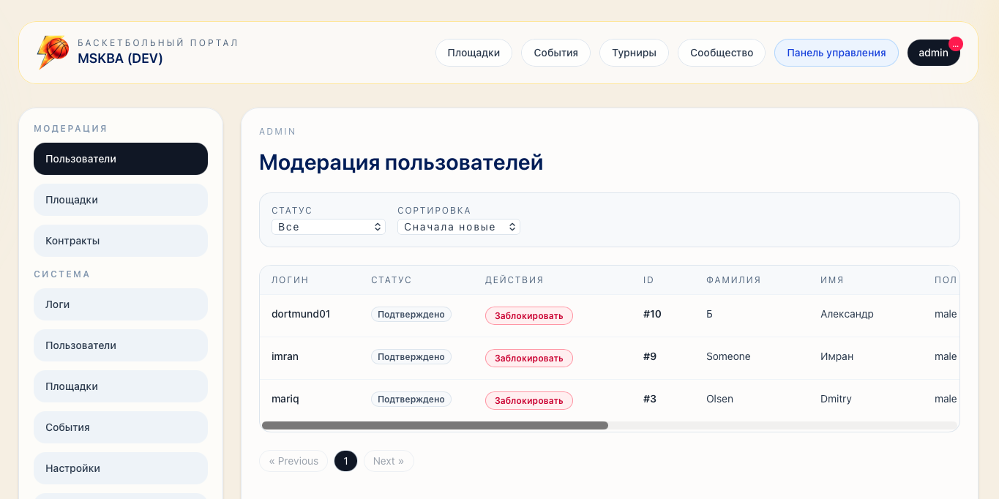

# MSKBA

Цифровой портал для баскетбольного сообщества: поиск площадок, организация игр и тренировок, коммуникация между игроками, тренерами, судьями и администраторами площадок.

**Демо:**
- [mskba.ru](https://mskba.ru) — прод. Ветка `main`, релизы после ручного approve в GitHub Actions.
- [dev.mskba.ru](https://dev.mskba.ru) — dev-стенд. Ветка `dev`, автодеплой на каждый push. Именно сюда сначала попадают новые фичи и исправления; после проверки изменения мёржатся в `main` и уезжают на прод.

**Тестовый доступ** (аккаунты с разными ролями для ознакомления с функционалом): [admean@mskba.ru](mailto:admean@mskba.ru)

---

## Скриншоты

### Каталог площадок


### Карточка площадки


### Создание события


### Модерация пользователей


---

## Возможности

- **Площадки** — каталог с фильтрами по удобствам, галерея, карта, адрес с автоматическим определением ближайшего метро.
- **События** — создание игр и тренировок, фильтры по типу и дате, автоматическое истечение.
- **Роли участников** — игрок, тренер, судья, администратор площадки, медиа, продавец, персонал.
- **Контракты площадки** — создатель / владелец / супервайзер / сотрудник с процессом модерации назначений владельца и супервайзера.
- **Модерация** — централизованный модерационный центр: пользователи, площадки, контракты, медиа. Статусы, комментарии, уведомления.
- **Авторизация** — логин + пароль, подтверждение контактов через email и Telegram-бота.
- **Realtime** — обновление счётчиков уведомлений и непрочитанных сообщений через WebSocket (Laravel Reverb).
- **Фоновые задачи** — автоматическое истечение бронирований, заявок на бронирование, контрактов и событий через Laravel Scheduler + очередь (`everyMinute`, `withoutOverlapping`). Каждая задача доступна и как отдельная artisan-команда для ручного запуска.
- **Адреса** — интеграция с Yandex (suggest + geocode), справочники городов и станций метро.
- **Админ-панель** — управление пользователями, площадками, настройками, SEO-метатегами, просмотр системных логов.
- **Аудит** — журналирование изменений ключевых сущностей.
- **Сообщения** — внутренние системные и пользовательские сообщения с шаблонами.

## Стек

**Backend**
- PHP 8.2+
- Laravel 12
- Laravel Reverb (WebSocket-сервер)
- Pusher / Laravel Echo (клиент realtime)
- Queue (database driver) + Laravel Scheduler — для фоновых задач и воркеров

**Frontend**
- Vue 3 + Inertia.js
- Tailwind CSS 4
- PrimeVue (UI-компоненты)
- Vite 7

**Инфраструктура**
- Ubuntu VDS + Nginx + systemd
- GitHub Actions: сборка фронтенда → деплой на dev и prod (prod с обязательным ручным approve)
- SQLite по умолчанию для локальной разработки, любая SQL-БД для прод

## Архитектура

Доменно-ориентированная структура под `app/Domain/`:

Addresses · Audit · Balances · Cities · Contracts · Events · Integrations · Media · Messages · Metros · Moderation · Notifications · Participants · Payments · Permissions · Seo · Users · Venues

Каждый домен содержит модели, enums, репозитории и сервисы. Контроллеры и Inertia-страницы — в `app/Http` и `resources/js/Pages`.

## Локальный запуск

```bash
git clone git@github.com:a2icer-art/mskba.git
cd mskba

composer install
cp .env.example .env
php artisan key:generate

touch database/database.sqlite
php artisan migrate --seed

npm install
composer run dev
```

После запуска сайт доступен на http://localhost:8000. Фронтенд (Vite) и очередь стартуют параллельно через `composer run dev`.

## Лицензия

[MIT](LICENSE)

---

Developed by **A2ice Dev**
